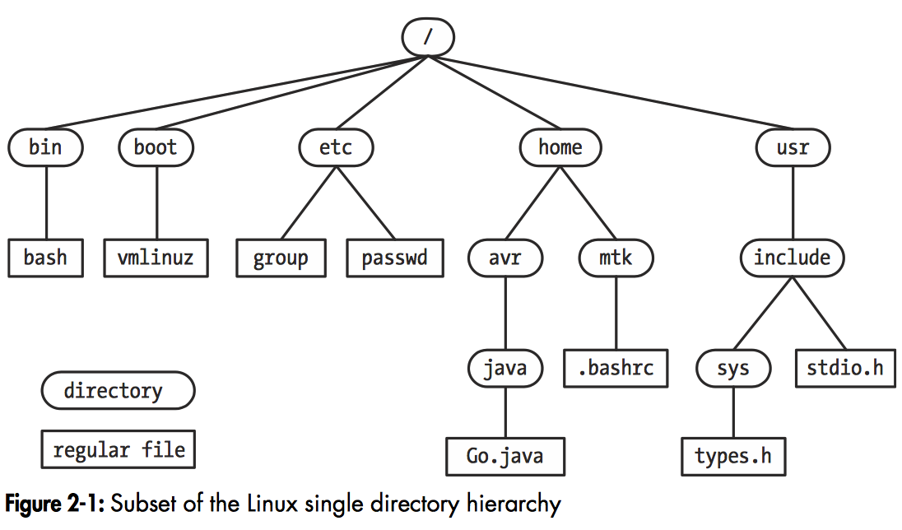

# FUNDAMENTAL CONCEPTS

## 内核

### 内核的任务

内核的作用是管理和分配计算机中的资源（如CPU、内存和设备等）。内核完成的任务如下：

* 进程调度。Linux是抢占式多任务操作系统，多个进程可以同时驻留在内存中，共同使用CPU。而CPU的数量是有限的，能同时运行的进程数量也是有限的。如果使用CPU的进程及使用的时间是由内核控制，而非进程自己决定的，就称为抢占式多任务。
* 内存管理。物理内存是有限的，操作系统必须控制各个进程对物理内存的使用。Linux使用虚拟内存的机制，它有两个优点：
  * 进程之间是相互隔离的，进程无法修改其他进程或内核使用的内存。
  * 对于每个进程，只有部分内存需要保留在物理内存中。物理内存可以维持更多的进程。
* 文件系统。内核提供文件系统的支持，以树形结构管理文件。
* 创建和终止进程。内核负责加载程序到内存中，并提供必要的资源以支持程序的运行。程序运行的实例称为进程。一旦进程运行结束，内核需保证其使用的资源被释放，以被后续运行的程序重新使用。
* 访问设备。内核通过接口标准化和简化了程序对外部设备的访问，同时对多个进程的设备访问进行协调。
* 网络。内核代表用户进程发送和接收网络消息，包括处理网络报文到目标系统的路由。
* 提供系统调用API。进程可以通过系统调用请求内核执行任务。

Linux作为多用户操作系统还提供虚拟私有计算机的抽象，每个用户可以登录到系统中近乎独立的进行操作。

### 内核态和用户态

现代处理器允许CPU运行在至少两种不同的模式：用户态和内核态，并提供硬件指令在两种模式间切换。虚拟内存也被相应的标记为用户空间和内核空间。当运行在用户态时，CPU仅可以访问被标记为用户空间的内存；当运行在内核态时，CPU可以访问用户空间和内核空间的内存。

某些操作仅允许在内核态执行，如停机指令、访问内存管理硬件、初始化设备IO操作等。通过硬件提供的机制，操作系统可以保证用户进程无法访问内核的指令和数据结构，或者执行对系统运行有负面影响的操作。

### 进程vs内核

进程无法知道何时被切换出去，无法知道其他进程被调度的时间和顺序，无法知道下一次运行的时间。信号和进程间通信事件的发生都由内核协调，对于进程来说可能发生在任何时间。系统中的很多设施对进程来说是透明的。进程无法知道其在物理内存中的位置，甚至无法知道其内存空间中的每一部分是否驻留在内存中（或是swap区域）。进程无法获知文件在磁盘上的位置，只能通过文件名进行引用。进程的运行是隔离的，无法直接与其它进程通信。进程也无法依靠自身创建新进程或是结束自己。最后，进程无法直接与输入输出设备通信。

与之相反，内核则控制着一切。内核简化了系统上所有进程的运行。它决定了下一个获得CPU的进程，获得的时间和时长；维护了所有运行进程的信息，响应进程创建新进程和结束进程的请求，在进程创建、更改状态和结束时进行信息更新；负责将程序使用的文件名翻译成磁盘上的物理位置；维护了每个进程的虚拟内存到物理内存和交换区域的映射。所有进程间的通信都通过内核提供的机制进行。内核还按照用户程序的要求，处理与输入输出设备的全部通信，并将信息传入和传出用户程序。

## Shell

`shell`被设计为读取用户输入的命令，并执行合适的程序响应这些命令，故也被称为命令解释器。

`login shell`表示用户登录时被创建来运行shell的进程。

在某些操作系统中，命令解释器是内核的一部分，但在UNIX系统中，shell是一个用户进程。shell有多种，同一计算机上的不同用户可以同时使用不同的shell。常见的shell有`Bourne shell(sh)`，`C shell(csh)`，`Korn shell(ksh)`，`Bourne again shell(bash)`。这些shell不仅仅供交互使用，还可以解析`shell脚本`，脚本是包含shell命令的文本文件。以此为目的，shell中包含了编程语言中的设施，如变量、循环、条件语句、IO命令和函数。每种shell都可完成相似的功能，但语法上有变化。

## 用户和组

系统中的每个用户都被唯一标识，用户属于组。

#### 用户

系统中的每个用户都有唯一的的登录名（用户名）和对应的数字ID（`uid`）。每个用户都在系统中的密码文件中定义（`/etc/passwd`），一行一个，包含以下附加信息：

* 组ID：用户所属的第一个组的数字ID
* Home目录：用户登录后被放置的初始目录
* Login shell：登录时执行的shell程序名称

密码记录还可包含加密形式的用户密码，但为了安全，密码通常被存放在独立的`shadow`文件中，只有特权用户才可读取。

#### 组

为了控制和管理对文件和其它系统资源的访问，用户通常被组织成组。每个组都被`group`文件（`/etc/group`）中的一行定义，包含以下信息：

* 组名：组的唯一名称
* 组ID：组的数字ID
* 用户列表：组成员的登录名，以逗号分隔。

#### 超级用户

超级用户对系统有特权。超级用户的用户ID为0，通常登录名为root。在一般的UNIX系统中，超级用户跳过了所有的系统权限检查。因此，超级用户可以无视文件权限设置，访问系统上的任意文件；发送信号给系统中的任意用户进程。系统管理员使用超级用户执行系统的管理任务。

### 单一目录层次、目录、链接和文件

内核维护了单一的目录层次结构来管理系统上的所有文件（与之相反，Windows的每个磁盘设备都有自己的目录层次）。在层次结构的顶端是根目录，命名为`/`。所有的文件和目录都是根目录的孩子或后代。

#### 文件类型

在文件系统中，每个文件都有类型。`regular`或`plain`文件表示普通的数据文件，其它的文件类型包括：设备、管道、socket、目录和符号链接。

#### 目录和链接

目录是一个特殊的文件，其内容类似一张文件名和文件引用的映射表，这种引用称为链接。文件可以有多个链接，因此可以有多个名字，分别存放在相同或不同的目录中。

目录中包含的链接可以指向文件或其它目录。目录间的链接建立了目录的层次。

每个目录都包含至少两个条目，`.(dot)`链接到其自身和`..(dot-dot)`链接到其父目录。每个目录，除了根目录，都有父目录。对于根目录，`..`条目链接到了它自身（因此`/..`和`/`是等价的）。

#### 符号链接

